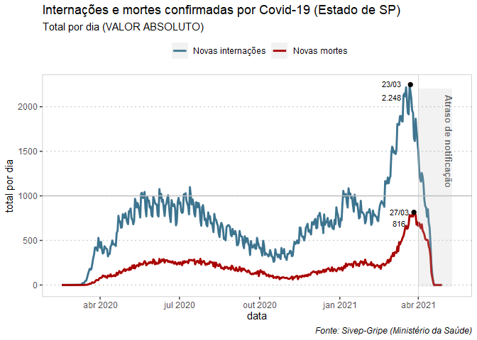
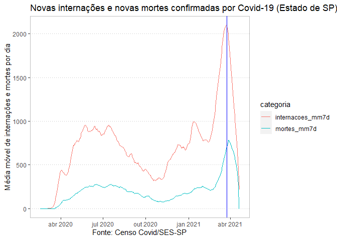
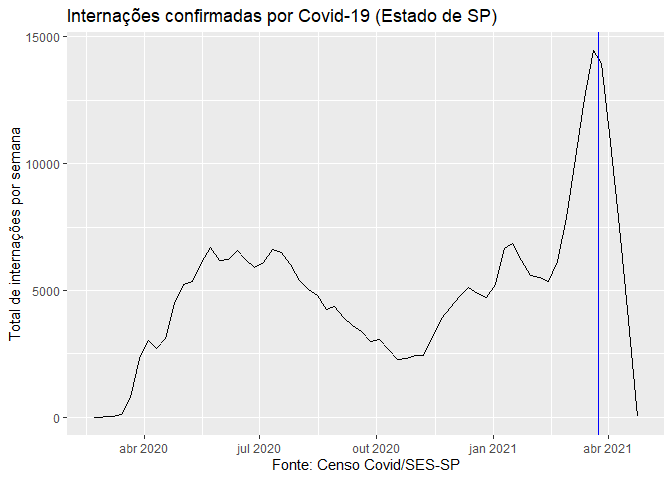
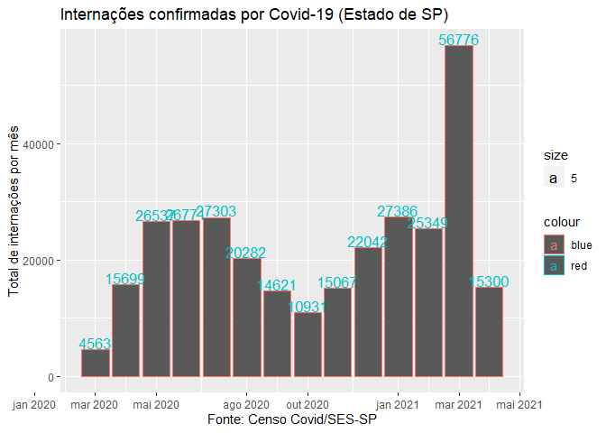

Análises do Sivep-Gripe
================
(Por Ana Carolina Moreno)
Relatório gerado em 27/04/2021 com dados atualizados até 19/04

<!-- README.md is generated from README.Rmd. Please edit that file -->

###### Fonte: Sivep-Gripe (Ministério da Saúde): [link para o OpenDatasus](opendatasus.saude.gov.br/)

<!-- badges: start -->
<!-- badges: end -->

Essa página contém análises de dados de casos confirmados de Covid-19 no
Estado de São Paulo.

#### 1- **TOTAL** de internações e mortes por dia

-   Linha vermelha: internações
-   Linha verde: mortes
-   Entre meados de março e o início de abril o Estado de SP registrou
    pelo menos 1.500 novos pacientes internados por dia
-   Já as mortes ficaram pelo menos acima de 500 por dia no período
-   O gráfico dá indícios de que existe uma relação entre o aumento da
    pressão no sistema hospitalar provocou também um aumento do risco de
    morrer pela doença

(A linha azul indica a partir de quando os dados caem devido ao atraso
de notificação)

``` r

plot(ggplot_covid_sp_dia)
```

<!-- -->

#### 2- **MÉDIA MÓVEL** de internações e mortes por dia

-   Linha vermelha: internações
-   Linha verde: mortes
-   O gráfico é o mesmo acima, mas está mais suavizado porque representa
    a média móvel de 7 dias

(A linha azul indica a partir de quando os dados caem devido ao atraso
de notificação)

``` r

plot(ggplot_covid_sp_dia_media)
```

<!-- -->

#### 3- **TOTAL** de internações por Covid por semana epidemiológica

-   Após meados de janeiro, houve uma queda nas novas internações por
    semana, mas a partir de meados de fevereiro ela começou a subir numa
    curva muito íngreme e quase triplicou até o fim de março

(A linha azul indica a partir de quando os dados caem devido ao atraso
de notificação)

``` r

plot(ggplot_covid_sp_semana)
```

<!-- -->

#### 4- **TOTAL** de internações por Covid por mês

-   O mês de março registrou quase 57 mil internações por Covid-19 no
    Estado de São Paulo.
-   Isso representa quase o dobro das internações em qualquer outro mês
    da pandemia.

(O total de abril ainda é preliminar e está sujeito a grande alterações)

``` r

plot(ggplot_covid_sp_mes)
```

<!-- -->
