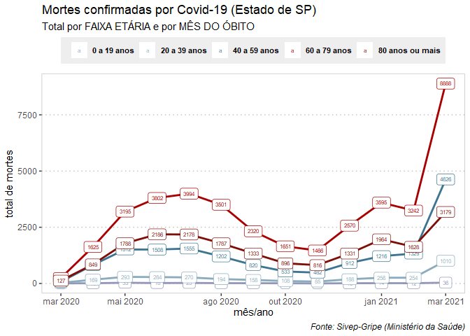

Análises do Sivep-Gripe
================
(Por Ana Carolina Moreno)
Relatório gerado em 27/04/2021 com dados atualizados até 19/04

<!-- README.md is generated from README.Rmd. Please edit that file -->

###### Fonte: Sivep-Gripe (Ministério da Saúde): [link para o OpenDatasus](opendatasus.saude.gov.br/)

<!-- badges: start -->
<!-- badges: end -->

Essa página contém análises de dados de casos confirmados de Covid-19 no
Estado de São Paulo.

    #> [1] "png"

#### 1- **TOTAL** de internações e mortes por dia

-   Linha vermelha: internações
-   Linha verde: mortes
-   Entre meados de março e o início de abril o Estado de SP registrou
    pelo menos 1.500 novos pacientes internados por dia
-   Já as mortes ficaram pelo menos acima de 500 por dia no período
-   O gráfico dá indícios de que existe uma relação entre o aumento da
    pressão no sistema hospitalar provocou também um aumento do risco de
    morrer pela doença

(A linha azul indica a partir de quando os dados caem devido ao atraso
de notificação)

``` r

plot(ggplot_covid_sp_dia)
```

<!-- -->

#### 2- **MÉDIA MÓVEL** de internações e mortes por dia

-   Linha vermelha: internações
-   Linha verde: mortes
-   O gráfico é o mesmo acima, mas está mais suavizado porque representa
    a média móvel de 7 dias

(A linha azul indica a partir de quando os dados caem devido ao atraso
de notificação)

``` r

plot(ggplot_covid_sp_dia_media)
```

<!-- -->

#### 3- *MORTES* por Covid por *MÊS* e por *FAIXA ETÁRIA*

-   Março de 2021 foi o mês com a maior ocorrência de mortes por
    Covid-19 em todas as faixas etárias.
-   No entanto, esse aumento se comportou de formas diferentes de acordo
    com a idade dos pacientes.
-   A faixa etária mais afetada segue sendo a das pessoas com entre 60 a
    79 anos: entre fevereiro e março, as mortes subiram de 3.242 para
    8.888.
-   Mas o aumento desproporcional de mortes entre os adultos não idosos,
    com entre 40 e 59 anos, chamou a atenção. Foram 4.626 mortes em
    março, contra 1.329 em fevereiro.
-   Com isso, essa faixa etária superou o grupo de pessoas com 80 anos
    ou mais, que também registrou aumento, mas em um ritmo menor: em
    março, foram 3.179 mortes, contra 1.628 mortes de fevereiro.

``` r

plot(ggplot_obitos_covid_sp_idade_20)
```

<!-- -->
