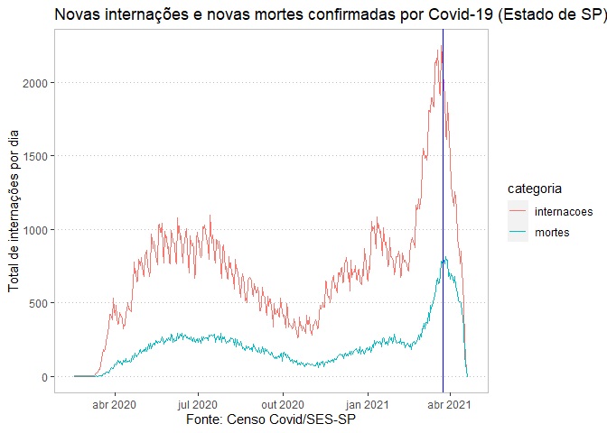

Análises do Sivep-Gripe
================
Ana Carolina Moreno
27/04/2021

<!-- README.md is generated from README.Rmd. Please edit that file -->

# Análises: Covid-19 no Estado de São Paulo

### Dados atualizados até **19/04/2021**

<!-- badges: start -->
<!-- badges: end -->

Essa página contém análises de dados de casos confirmados de Covid-19 no
Estado de São Paulo.

``` r
summary(cars)
#>      speed           dist       
#>  Min.   : 4.0   Min.   :  2.00  
#>  1st Qu.:12.0   1st Qu.: 26.00  
#>  Median :15.0   Median : 36.00  
#>  Mean   :15.4   Mean   : 42.98  
#>  3rd Qu.:19.0   3rd Qu.: 56.00  
#>  Max.   :25.0   Max.   :120.00
```

You’ll still need to render `README.Rmd` regularly, to keep `README.md`
up-to-date. `devtools::build_readme()` is handy for this. You could also
use GitHub Actions to re-render `README.Rmd` every time you push. An
example workflow can be found here:
<https://github.com/r-lib/actions/tree/master/examples>.

You can also embed plots, for example:

<!-- -->

Teste da Carol

    #> -- Attaching packages --------------------------------------- tidyverse 1.3.0 --
    #> v ggplot2 3.3.3     v purrr   0.3.4
    #> v tibble  3.1.0     v dplyr   1.0.5
    #> v tidyr   1.1.3     v stringr 1.4.0
    #> v readr   1.4.0     v forcats 0.5.1
    #> -- Conflicts ------------------------------------------ tidyverse_conflicts() --
    #> x dplyr::filter() masks stats::filter()
    #> x dplyr::lag()    masks stats::lag()
    #> 
    #> Attaching package: 'lubridate'
    #> The following objects are masked from 'package:base':
    #> 
    #>     date, intersect, setdiff, union
    #> 
    #> Attaching package: 'zoo'
    #> The following objects are masked from 'package:base':
    #> 
    #>     as.Date, as.Date.numeric
    #> 
    #> Attaching package: 'tidylog'
    #> The following objects are masked from 'package:dplyr':
    #> 
    #>     add_count, add_tally, anti_join, count, distinct, distinct_all,
    #>     distinct_at, distinct_if, filter, filter_all, filter_at, filter_if,
    #>     full_join, group_by, group_by_all, group_by_at, group_by_if,
    #>     inner_join, left_join, mutate, mutate_all, mutate_at, mutate_if,
    #>     relocate, rename, rename_all, rename_at, rename_if, rename_with,
    #>     right_join, sample_frac, sample_n, select, select_all, select_at,
    #>     select_if, semi_join, slice, slice_head, slice_max, slice_min,
    #>     slice_sample, slice_tail, summarise, summarise_all, summarise_at,
    #>     summarise_if, summarize, summarize_all, summarize_at, summarize_if,
    #>     tally, top_frac, top_n, transmute, transmute_all, transmute_at,
    #>     transmute_if, ungroup
    #> The following objects are masked from 'package:tidyr':
    #> 
    #>     drop_na, fill, gather, pivot_longer, pivot_wider, replace_na,
    #>     spread, uncount
    #> The following object is masked from 'package:stats':
    #> 
    #>     filter
    #> Loading required package: Matrix
    #> 
    #> Attaching package: 'Matrix'
    #> The following objects are masked from 'package:tidyr':
    #> 
    #>     expand, pack, unpack

<!-- -->

In that case, don’t forget to commit and push the resulting figure
files, so they display on GitHub.
