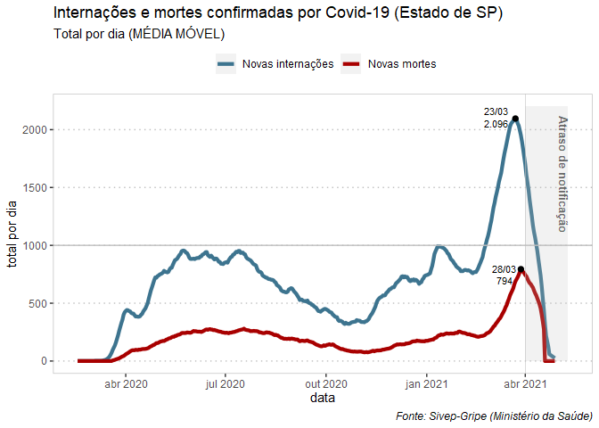

Análises do Sivep-Gripe
================
Ana Carolina Moreno
27/04/2021

<!-- README.md is generated from README.Rmd. Please edit that file -->

### Dados atualizados até **19/04/2021**

<!-- badges: start -->
<!-- badges: end -->

Essa página contém análises de dados de casos confirmados de Covid-19 no
Estado de São Paulo.

## 1- **Total** de internações e mortes por dia

-   Linha vermelha: internações
-   Linha verde: mortes
-   Entre meados de março e o início de abril o Estado de SP registrou
    pelo menos 1.500 novos pacientes internados por dia
-   Já as mortes ficaram pelo menos acima de 500 por dia no período
-   O gráfico dá indícios de que existe uma relação entre o aumento da
    pressão no sistema hospitalar provocou também um aumento do risco de
    morrer pela doença

(A linha azul indica a partir de quando os dados caem devido ao atraso
de notificação)

``` r

plot(ggplot_covid_sp_dia)
```

<!-- -->

-   2- ***Média móvel*** de internações e mortes por dia

-   Linha vermelha: internações

-   Linha verde: mortes

-   O gráfico é o mesmo acima, mas está mais suavizado porque representa
    a média móvel de 7 dias

(A linha azul indica a partir de quando os dados caem devido ao atraso
de notificação)

``` r

plot(ggplot_covid_sp_dia_media)
```

<!-- -->
